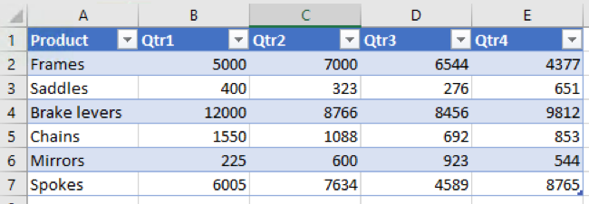
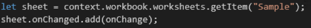
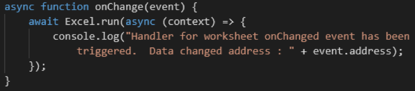
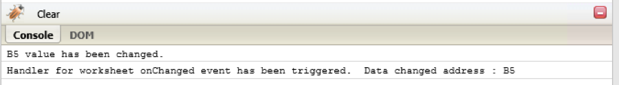

_[Workshop home](../../index.md)_  >  _[New Excel JavaScript APIs](../index.md)_ > _[Event API additions](index.md)_ > _Exercise_

# Exercise

In this exercise, you are going to register an event handler to a worksheet. Once the data in the worksheet is changed, print log in the console

Step 1: Add some data manually to the worksheet.

Step 2: Register OnChanged event hanlder to the worksheet.

Step 3: Change any value of cells, print the address of the changed cells in the console in your event handler like:

