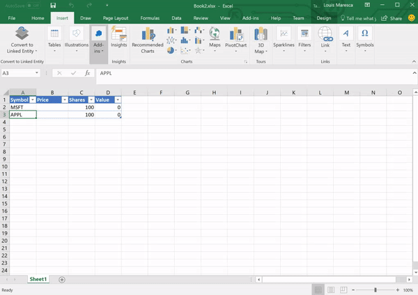
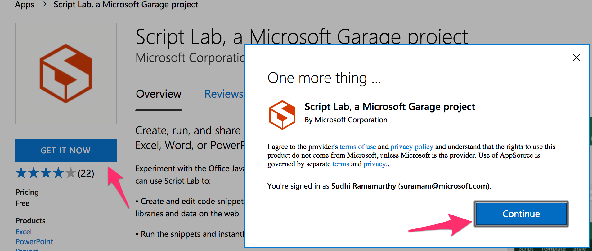
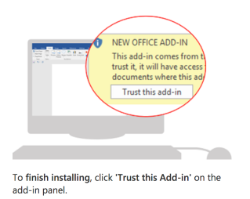
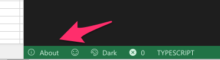
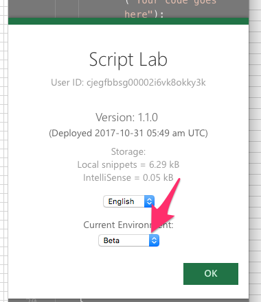

_[Workshop home](../index.md)_  >  _[New Excel JavaScript APIs](index.md)_ > _Setup_

# Setup

Follow the steps below to try out the APIs yourself. If you want to try the custom functions preview, separate setup steps apply - see [Custom Functions Setup](../misc/setup-custom-functions.md).

## Excel desktop application
Ensure you have an O365 monthly build of Excel installed on your laptop. Any recent build is sufficient (no need for Dogfood build).

## Install Script Lab add-in
Script Lab is a fantastic tool and a playground for office Add-ins. Thsi tool will allow us to share the new programming models with you without having to leave the application to do it. All the samples shown in the hands-on section would require you to try them in Script Lab.

Script Lab can be installed two easy ways.
### 1 Via Add-ins Within Excel
With-in your Office Application navigate to the Insert Tab on the Ribbon. Once there, there should be a Add-ins Group and an Add-ins Button. Select the button dropdown and click on My Add-ins. 
Once you select My Add-ins , Navigate to the Store tab and search for 'Script Lab'. Install Script Lab.

### 2 Via the Office Store
Visit the [Office store](https://appsource.microsoft.com/en-us/product/office/WA104380862?src=office&corrid=a257208a-d3f9-420c-94ec-c8fd2159c70e&omexanonuid=f9380de0-aa58-499b-82d9-a1075967d2dc) and click on "GET IT NOW". This will show acquisition promotes. Follow along and finally click on Open in Excel link.

 

Once in Excel, click on trust this add-in button. If the add-in doesn't open automatically, you can manually open it - you'll see Script Lab ribbon option inside the app. Click the editor ribbon command to launch the add-in.

## Change to beta mode

This step will allow you to switch to beta mode of the office-js library. 

